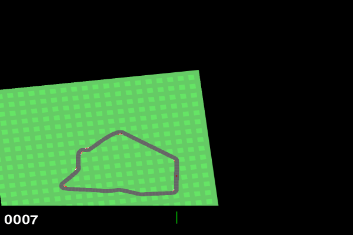
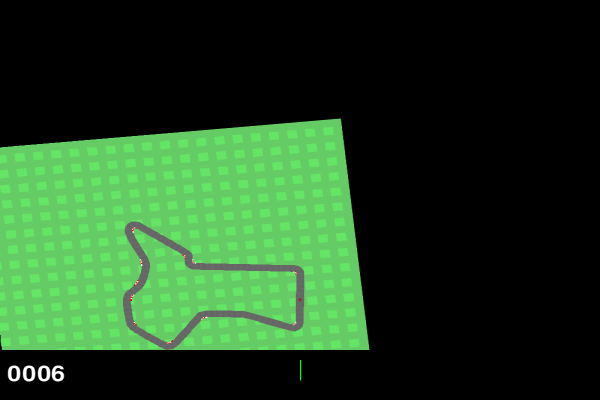

<p align="center">
  
  <br>
  <em>PPO agent scoring 928 — trained from scratch in ~10 hours on a single T4 GPU</em>
</p>

# CarRacing PPO

A from-scratch implementation of **Proximal Policy Optimization** that learns to drive in OpenAI Gymnasium's CarRacing-v2 from raw pixels. No pretrained models, no Stable-Baselines3 — just PyTorch, a CNN, and 5 million frames of practice.

## Results

<table>
<tr>
<td align="center"><strong>Before Training</strong></td>
<td align="center"><strong>After Training</strong></td>
</tr>
<tr>
<td align="center"></td>
<td align="center"></td>
</tr>
<tr>
<td align="center">Random agent: ~-50 reward</td>
<td align="center">Trained agent: 865 median reward</td>
</tr>
</table>

### 50-Episode Evaluation (Best Checkpoint)

| Metric | Value |
|:--|--:|
| Median reward | **864.7** |
| Max reward | **933.3** |
| Mean reward | 632.1 +/- 363 |
| Episodes > 700 | 66% (33/50) |
| Episodes > 500 | 72% (36/50) |

> Human-level performance on CarRacing is ~900. The bimodal distribution (some low, most high) is characteristic of this environment — procedurally generated tracks mean some layouts have sharp turns that are harder to navigate.

### Training Curve

| Step | Eval Reward | Notes |
|--:|--:|:--|
| 50K | -7.7 | Learning to stay on road |
| 500K | 1.0 | Minimal forward progress |
| 1.5M | 23.2 | Starting to follow track |
| 2.5M | 99.2 | Consistent forward driving |
| 3.0M | 155.4 | Taking turns |
| 4.0M | 307.5 | Completing partial laps |
| 4.2M | 630.5 | Near-complete laps |
| 4.7M | 752.7 | Consistent lap completion |
| **4.9M** | **811.9** | **Best model saved** |

<details>
<summary>Training progression GIF (5 checkpoints side-by-side)</summary>
<p align="center">
  
  <br>
  <em>Left to right: 1M, 2.25M, 3.25M, 4.5M, 5M steps</em>
</p>
</details>

## How It Works

### Architecture

```
 Observation: 4 stacked grayscale frames (4 x 84 x 84)
                        |
                        v
 ┌─────────────────────────────────────────┐
 │           Shared CNN Backbone           │
 │                                         │
 │  Conv2d(4→32, 8x8, stride 4) → ReLU    │
 │  Conv2d(32→64, 4x4, stride 2) → ReLU   │
 │  Conv2d(64→64, 3x3, stride 1) → ReLU   │
 │  Flatten → Linear(3136→512) → ReLU      │
 └──────────────┬──────────────┬───────────┘
                |              |
         ┌──────┘              └──────┐
         v                            v
 ┌───────────────┐           ┌────────────────┐
 │  Actor Head   │           │  Critic Head   │
 │               │           │                │
 │ Linear(512→3) │           │ Linear(512→1)  │
 │ + tanh scale  │           │                │
 │ + learned std │           │ → V(s)         │
 │ → Normal dist │           └────────────────┘
 │ → [steer,     │
 │    gas,       │
 │    brake]     │
 └───────────────┘

 Actions:  steer ∈ [-1, 1]    gas ∈ [0, 1]    brake ∈ [0, 1]
 Params:   1,686,183 total
```

### Key Design Decisions

| Decision | Why |
|:--|:--|
| **PPO over DQN** | CarRacing has continuous actions (steer/gas/brake). DQN needs discrete actions; PPO naturally handles continuous control via Gaussian distributions. |
| **Frame stacking (4 frames)** | A single frame has no motion info. Stacking gives the network implicit velocity and acceleration, satisfying the Markov property. |
| **Centered tanh scaling** | Maps unbounded network outputs to valid action ranges without gradient saturation. Each dimension scales around its center. |
| **Learnable log_std** | Started at -1.0 (std=0.37), clamped to [-2.5, 0.5]. Allows the agent to learn its own exploration-exploitation schedule. |
| **Reward normalization** | Running mean/std scaling stabilizes training as reward magnitudes change throughout episodes. |
| **8 parallel envs** | Decorrelated samples per PPO batch. Sequential single-env data is highly correlated; parallel envs improve stability. |

### PPO Algorithm

```
For each rollout (256 steps x 8 envs = 2048 transitions):
  1. Collect experience using current policy
  2. Compute advantages using GAE (λ=0.95, γ=0.99)
  3. For 4 epochs over random minibatches of 256:
     - Compute probability ratio: r = π_new(a|s) / π_old(a|s)
     - Clipped policy loss:  -min(r·A, clip(r, 0.8, 1.2)·A)
     - Value loss:           0.5 · MSE(V(s), returns)
     - Entropy bonus:        -0.01 · H(π)
     - Early stop if KL divergence > 0.02
```

## Reproduce

```bash
# Clone and install
git clone https://github.com/YOUR_USERNAME/carracing-ppo.git
cd carracing-ppo
pip install -r requirements.txt

# Train (takes ~10 hours on a T4 GPU)
python scripts/train.py

# Monitor
tail -f logs/train_v5.log

# Evaluate best checkpoint
python scripts/eval_detailed.py

# Record GIFs
python scripts/record_hero.py
python scripts/record_gif.py
```

## Hyperparameters

All hyperparameters live in [`configs/default.yaml`](configs/default.yaml) — nothing is hardcoded in Python.

| Parameter | Value | Purpose |
|:--|--:|:--|
| `n_envs` | 8 | Parallel environment workers |
| `rollout_steps` | 256 | Steps collected before each update |
| `n_epochs` | 4 | Gradient steps per rollout |
| `minibatch_size` | 256 | SGD batch size |
| `lr` | 2.5e-4 | Learning rate (linear decay to 10%) |
| `gamma` | 0.99 | Discount factor |
| `gae_lambda` | 0.95 | GAE bias-variance tradeoff |
| `clip_eps` | 0.2 | PPO clipping range |
| `ent_coef` | 0.01 | Entropy bonus weight |
| `target_kl` | 0.02 | KL early stopping threshold |

## Project Structure

```
carracing-ppo/
├── configs/
│   └── default.yaml          # All hyperparameters (source of truth)
├── src/
│   ├── env_utils.py           # Wrappers: grayscale, resize, normalize, frame stack
│   ├── model.py               # ActorCritic CNN with Gaussian policy
│   ├── ppo.py                 # GAE computation + clipped PPO update
│   ├── trainer.py             # Training loop with reward normalization + W&B
│   └── evaluate.py            # Greedy evaluation + GIF recording
├── scripts/
│   ├── train.py               # Hydra entry point
│   ├── record_gif.py          # Progression GIF from checkpoints
│   ├── record_hero.py         # Best-episode hero GIF
│   └── eval_detailed.py       # 50-episode eval with statistics
├── dashboard/
│   └── app.py                 # Streamlit live replay dashboard
├── tests/                     # Phase verification scripts
├── assets/                    # GIFs for this README
├── BUILD_LOG.txt              # Detailed build + training log
└── CLAUDE.md                  # Build specification
```

## Bugs I Fixed Along the Way

| Bug | Root Cause | Fix |
|:--|:--|:--|
| **Action saturation** | `tanh(large_number)` = flat gradient | Centered tanh scaling + small init gain (0.01) keeps outputs in linear regime |
| **log_std not learning** | Clamped at boundary, gradient = 0 | Widened clamp range, initialized in middle |
| **Value loss instability** | Value clipping can be counterproductive | Removed value clipping, used simple MSE |
| **KL early stopping every epoch** | 10 epochs too aggressive | Reduced to 4 epochs per rollout |
| **box2d float32 crash** | Python 3.13 SWIG binding type mismatch | Custom `Float64Action` wrapper |
| **CarRacing-v3 not found** | gymnasium 0.29.1 only has v2 | Changed env ID |

## Built With

- **PyTorch** — model, optimizer, GPU acceleration
- **Gymnasium** — CarRacing-v2 environment
- **Hydra** — configuration management
- **W&B** — experiment tracking
- **Streamlit** — live demo dashboard

---

<p align="center">
  <sub>Built as a portfolio project to demonstrate RL fundamentals. No Stable-Baselines3, no pretrained models — everything from scratch.</sub>
</p>
