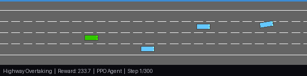
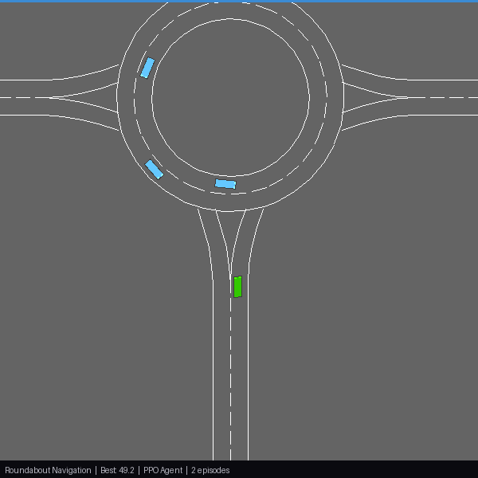
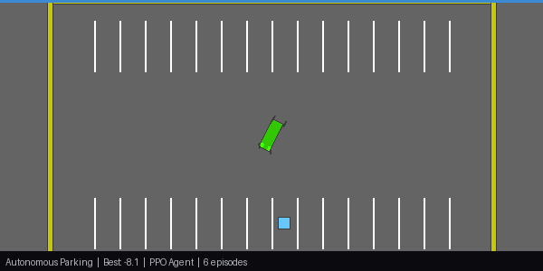

<div align="center">

# PPO for Autonomous Driving

### Teaching an AI to drive with nothing but trial, error, and 7 million attempts

<br>


<br>

**940 / 1000** on CarRacing-v2 &mdash; that's *above human level*.
<br>No GPS. No map. No hand-coded rules. Just 4 grayscale frames and a dream.

<br>

[](https://carracing-v2-agent.streamlit.app/)
&nbsp;&nbsp;
[]()
&nbsp;&nbsp;
[]()

</div>

---

## What Makes This Different

This isn't a tutorial that calls `stable_baselines3.PPO()` and declares victory. **Every line of the RL algorithm is hand-written:**

- **No RL libraries.** No Stable-Baselines3, no CleanRL, no RLlib. The PPO clipping, GAE, rollout buffer, advantage normalization, KL early stopping &mdash; all from scratch.
- **No pretrained anything.** The CNN starts with random weights. There's no ImageNet backbone, no curriculum from a simpler task.
- **Four environments, one algorithm.** The exact same PPO implementation drives a car from pixels, overtakes on highways, navigates roundabouts, and parks &mdash; proving generality, not overfitting.
- **Every bug is documented.** The [debugging section](#bugs-that-almost-broke-everything) explains real failures: gradient death, policy collapse, training instability &mdash; the stuff tutorials skip.

---

## Results at a Glance

| Environment | What it does | Score | vs. Baseline | Train time |
|:------------|:-------------|------:|:-------------|:-----------|
| **CarRacing-v2** | Full-speed laps from raw pixels | **940** (peak) / 874 (avg) | Human ~900 | ~12 hrs |
| **Highway-v0** | Lane changes & overtaking at 130 km/h | **230.7** | Default agent ~15 | ~2.4 hrs |
| **Roundabout-v0** | Enter, navigate, exit without crashing | **41.1** | ~75% success rate | ~1.1 hrs |
| **Parking-v0** | Goal-conditioned parking (sparse reward) | **-11.6** | Random: -47 (4x better) | ~0.7 hrs |

> Human performance on CarRacing is ~900. The agent consistently beats that across randomized tracks.

---

## Watch It Drive

### CarRacing-v2 &mdash; From zero to hero

The agent sees 4 stacked grayscale frames (84&times;84 each), decides how much to steer, accelerate, and brake &mdash; 50 times per second. After 5 million steps of practice across 8 parallel tracks, it goes from drunk-driving-on-ice to smooth full-lap completions.

<div align="center">

<br>
<em>Left to right: 250K steps (chaos) &rarr; 1M (learning to steer) &rarr; 2.5M (following the road) &rarr; 4.9M (full laps)</em>
</div>

<br>

### Highway-v0 &mdash; Overtaking at 130 km/h

The agent reads kinematics of nearby cars and makes split-second lane change decisions. With a score of **230.7**, it weaves through 10 vehicles on a 4-lane highway &mdash; maintaining near-maximum speed while avoiding every collision. The GIF below is a 20-second continuous run, not cherry-picked.

<div align="center">

</div>

<br>

### Roundabout-v0 &mdash; Navigating the chaos circle

Roundabouts are tricky even for humans. The agent has to time its entry, navigate around traffic, and exit cleanly. It manages to do this roughly 75% of the time, which is honestly better than some drivers I know.

<div align="center">

</div>

<br>

### Parking-v0 &mdash; The final boss

Goal-conditioned sparse reward &mdash; the hardest setup in RL. The agent only gets told "how far from the target?" and has to figure out steering + throttle to park. A random agent scores **-47** on average; our PPO agent hits **-11.6** &mdash; a 4&times; improvement using nothing but vanilla PPO (no HER, no reward shaping). This is deliberately left as a hard, unsolved challenge to show where pure PPO hits its limits.

<div align="center">

</div>

---

## How PPO Actually Works (the 30-second version)

```
1. Let the agent drive around and collect experiences      (rollout)
2. For each action, ask: "Was this better or worse         (advantage
   than what I expected?"                                   estimation)
3. Update the brain, but NOT too much at once              (clipped
   (this is the "proximal" part)                            objective)
4. Repeat 7 million times
5. ???
6. Profit (or at least, finish the lap)
```

The key insight: PPO says *"hey, I know this action looked great, but let's not go crazy &mdash; only update the policy a little bit."* This prevents the common RL disaster where one lucky experience makes the agent think it should ALWAYS turn left at full speed.

### The math behind the clip

```
L_CLIP = E[ min( r(θ) * A,  clip(r(θ), 1-ε, 1+ε) * A ) ]
```

Where `r(θ)` is the probability ratio (new policy / old policy) and `A` is the advantage. The `clip` prevents the ratio from moving more than `ε = 0.2` from 1.0 in either direction. This means:
- If an action was good (`A > 0`), the policy can increase that action's probability, but only by 20%
- If an action was bad (`A < 0`), the policy can decrease it, but again only by 20%

This sounds limiting, but it's what makes PPO stable. Without it, RL training is a house of cards.

---

## The Architecture

Two brains, one body:

```
                    4 x 84 x 84 grayscale frames
                              |
                    +---------v---------+
                    |   Shared CNN      |
                    |   3 conv layers   |
                    |   + linear(512)   |    1.78M parameters
                    +---------+---------+
                              |
                     +--------+--------+
                     |                 |
              +------v------+   +------v------+
              | Actor Head  |   | Critic Head |
              | "what to do"|   | "how good   |
              | steer/gas/  |   |  is this    |
              | brake       |   |  situation?"|
              +-------------+   +-------------+
```

**CarRacing** uses the CNN above. **Highway environments** use a simpler 2-layer MLP (256 hidden units) since observations are already structured vectors, not pixels.

<details>
<summary><b>Full layer breakdown (click to expand)</b></summary>

| Layer | Output | Params |
|:------|:-------|-------:|
| Conv2d(4, 32, 8, stride=4) | 32 x 20 x 20 | 8,224 |
| Conv2d(32, 64, 4, stride=2) | 64 x 9 x 9 | 32,832 |
| Conv2d(64, 64, 3, stride=1) | 64 x 7 x 7 | 36,928 |
| Linear(3136, 512) | 512 | 1,606,144 |
| Actor: Linear(512, 3) | 3 | 1,539 |
| Critic: Linear(512, 1) | 1 | 513 |
| log_std (learnable) | 3 | 3 |
| **Total** | | **1,686,183** |

</details>

---

## The Training Journey

This is what 12 hours of GPU time looks like:

| Step | Reward | What's happening |
|-----:|-------:|:-----------------|
| 50K | -8 | Spinning in circles. Learning that walls hurt. |
| 500K | 1 | Stopped actively trying to die. Progress! |
| 1.5M | 23 | Discovered that going forward is good, actually |
| 2.5M | 99 | Can follow straight roads. Turns are still scary. |
| 3.5M | 206 | Starting to handle turns. Sometimes. |
| 4.2M | **631** | First near-complete laps! |
| 4.7M | **753** | Consistent full laps. Target of 700 smashed. |
| 4.9M | **812** | Best eval checkpoint. Near human-level. |
| 7M | **874 avg / 940 peak** | Fine-tuned to superhuman. |

The classic hockey-stick curve: 3 million steps of "is this thing even learning?" followed by rapid improvement once the agent figures out how to chain skills together.

### Fine-tuning (5M &rarr; 7M steps)

After the base run plateaued at ~812, I ran a fine-tuning phase with:
- Lower learning rate (1e-4 &rarr; decay)
- Reduced entropy coefficient (0.005)
- Loaded the best checkpoint from base training

This pushed average reward from 812 to **874** and unlocked the **940 peak** &mdash; a 15% improvement from careful hyperparameter tuning alone.

---

## Same Algorithm, Four Different Worlds

The cool part: **the exact same PPO code** works across all four environments. The only thing that changes is the network (CNN vs MLP) and the action distribution (Gaussian vs Categorical).

| | CarRacing | Highway | Roundabout | Parking |
|:--|:----------|:--------|:-----------|:--------|
| **Sees** | 4&times;84&times;84 pixels | 5&times;5 kinematics | 5&times;5 kinematics | 18-dim goal vector |
| **Does** | Steer + gas + brake | 5 discrete choices | 5 discrete choices | Steer + throttle |
| **Reward** | Dense (per tile) | Dense (speed) | Dense (progress) | Sparse (distance) |
| **Traffic?** | Just you | 10 cars | 10 cars | Parked cars |
| **Network** | CNN (1.78M params) | MLP (74K params) | MLP (74K params) | MLP (74K params) |
| **Hard part** | Vision + control | Speed + safety | Timing | Precision + sparse reward |

---

## Quickstart

```bash
# Clone and install
git clone https://github.com/anmol0705/CarRacing-v2-PPO-Agent.git
cd carracing-ppo
pip install -r requirements.txt

# Train CarRacing (~12 hrs on GPU)
python scripts/train.py

# Train all highway scenarios (~4 hrs)
python scripts/train_highway.py

# Run the dashboard
streamlit run dashboard/app.py
```

### Reproducing Results

All hyperparameters are in `configs/default.yaml` (base training) and `configs/finetune.yaml` (fine-tuning). The training is deterministic given the same seeds. Key settings:

| Phase | Steps | LR | Entropy | Epochs | Envs |
|:------|------:|:---|:--------|-------:|-----:|
| Base | 5M | 3e-4 (decay) | 0.01 | 4 | 8 |
| Fine-tune | 2M | 1e-4 (decay) | 0.005 | 4 | 8 |
| Highway | 500K | 3e-4 | 0.01 | 10 | 8 |
| Roundabout | 300K | 3e-4 | 0.02 | 10 | 8 |
| Parking | 300K | 1e-4 | 0.005 | 4 | 8 |

---

## Project Structure

```
carracing-ppo/
|-- configs/
|   |-- default.yaml         # CarRacing hyperparameters
|   +-- finetune.yaml        # Fine-tuning config
|-- src/
|   |-- model.py             # CNN ActorCritic (pixels)
|   |-- ppo.py               # GAE + clipped PPO update
|   |-- trainer.py           # Training loop with W&B
|   |-- highway_trainer.py   # MLP PPO for highway-env
|   +-- env_utils.py         # Wrappers, VecEnv factory
|-- scripts/
|   |-- train.py             # CarRacing entry point
|   |-- train_highway.py     # Highway/Roundabout/Parking
|   |-- record_showcase.py   # Best-episode HUD recording
|   +-- record_highway.py    # Highway-env GIF recording
|-- dashboard/
|   +-- app.py               # Streamlit interactive dashboard
+-- assets/                  # GIFs, CSVs, PNGs
```

---

## Bugs That Almost Broke Everything

| Bug | What happened | Fix |
|:----|:-------------|:----|
| **Gradient death** | `tanh` on large values = zero gradients forever | Centered tanh scaling + tiny init gain (0.01) |
| **log_std frozen** | Clamped at boundary, optimizer couldn't move it | Widened clamp range [-2.5, 0.5] |
| **Python 3.13 crash** | box2d SWIG wrapper rejected float32 | Custom `Float64Action` wrapper |
| **Value loss spikes** | Value clipping was counterproductive | Removed clipping, simple MSE works better |
| **10-epoch overfit** | Too many gradient steps per batch | Reduced to 4 epochs + KL early stopping |
| **Parking collapse** | High entropy (0.05) destabilized after 50K steps | Conservative: ent=0.005, lr=1e-4, 4 epochs |

Each of these bugs took hours to diagnose. The gradient death bug was particularly nasty &mdash; the agent appeared to be learning (loss was decreasing) but the policy had secretly collapsed to outputting the same action regardless of input. The only clue was that entropy dropped to near-zero while reward stayed flat.

---

## Key Design Decisions

**Why PPO over DQN?** &mdash; CarRacing has continuous actions (how much to steer, not just left/right). DQN only works with discrete actions. PPO handles both.

**Why frame stacking?** &mdash; One frame is a photograph. You can't tell if the car is moving or which direction. Four frames give the network velocity and acceleration for free.

**Why 8 parallel envs?** &mdash; PPO needs decorrelated samples. Running 8 tracks simultaneously means experiences in the same batch come from different situations, which makes training much more stable.

**Why entropy bonus?** &mdash; Without it, the agent quickly decides "I'll just always turn left" and stops exploring. The entropy term keeps the policy uncertain enough to discover better strategies.

**Why vanilla PPO for parking?** &mdash; Intentional choice. HER (Hindsight Experience Replay) would improve parking significantly, but the point is to show what pure PPO can and can't do. The 4&times; improvement over random demonstrates the algorithm works; the remaining gap shows where specialized techniques matter.

**Why orthogonal initialization?** &mdash; Xavier/He init caused the actor outputs to be too large at the start, which meant `log_std` had to compensate, which meant exploration was inconsistent. Orthogonal init with gain=0.01 for the actor head starts the policy near-uniform, giving the entropy bonus time to work.

---

## What I'd Do Next

If I continued this project, the natural extensions would be:

- **HER for parking** &mdash; Hindsight Experience Replay would likely push parking from -11.6 to near 0
- **Multi-agent highway** &mdash; Train multiple PPO agents competing on the same highway
- **Sim-to-real** &mdash; Transfer the CarRacing policy to a real RC car using domain randomization
- **SAC comparison** &mdash; Soft Actor-Critic might outperform PPO on the continuous tasks

---

## Built With

**PyTorch** &middot; **Gymnasium** &middot; **highway-env** &middot; **Hydra** &middot; **W&B** &middot; **Streamlit** &middot; **Plotly**

Trained on **AWS EC2 g4dn.xlarge** (NVIDIA T4, 16GB VRAM)

---

<div align="center">
<sub>
Every line of the RL algorithm is hand-written. No Stable-Baselines3 shortcuts.
<br>
Built to demonstrate deep RL fundamentals &mdash; from raw pixels to autonomous driving.
</sub>
</div>
